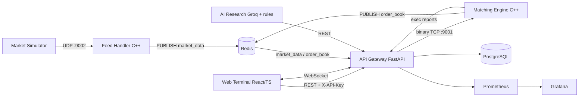

# QuantForge

A low-latency, microservices **electronic trading stack** — a C++ matching engine and market-data feed handler, a Python risk/execution gateway, an AI research pipeline, and a Bloomberg-style web terminal, wired together over binary TCP/UDP and Redis pub/sub, with Postgres persistence and Prometheus/Grafana observability.

It is built to demonstrate the core competencies of low-latency trading-infrastructure engineering: **C++ + Linux + TCP/UDP networking + concurrency + a price-time-priority matching engine + pre-trade risk + market simulation**.

```
   Market Simulator ──UDP──▶ Feed Handler ──┐
                                            ▼
   Terminal ◀──WebSocket──┐            Redis pub/sub ──market_data / order_book──┐
        │                 │                                                      │
        └──REST(+API key)─▶  API Gateway  ◀────────────────────────────────────┘
                              │   ▲  │
              binary TCP      │   │  └──▶ PostgreSQL (orders, fills, positions)
              order entry  ┌──▼   │ exec reports
                           │  Matching Engine (C++) ──Redis──▶ order_book snapshots
   AI Research ─REST─▶ Gateway        │  (per-symbol locked order books)
   (Groq + rules)              Prometheus ─▶ Grafana
```

<details>
<summary>Detailed component diagram (Mermaid)</summary>


</details>

---

## Why it maps to low-latency trading roles

| Signal | Where it lives |
| --- | --- |
| **C++ systems programming** | `matching_engine/`, `feed_handler/`, `shared/cpp/` |
| **Order-book / matching** | `OrderBook.cpp` — price-time priority, partial fills, FIX-style execution reports |
| **Concurrency** | `MatchingEngine` — per-symbol locking (symbols match in parallel) |
| **TCP / UDP networking** | binary TCP order entry, UDP market data, hand-rolled Redis RESP client |
| **Fixed-point / correctness** | prices are **integer ticks**, never floats, across the wire and the book |
| **Pre-trade risk** | `gateway/app/risk.py` — size, position, and drawdown limits in one transaction |
| **Market simulation** | `scripts/market_simulator.py` UDP tick generator |
| **Performance discipline** | Release `-O3 -march=native` + LTO, plus a reproducible micro-benchmark |
| **Observability / ops** | Prometheus metrics, provisioned Grafana, health checks, kill switch |

---

## Performance

The matching engine ships with an in-process micro-benchmark (no network) so the
numbers are reproducible rather than asserted:

```bash
cmake -B build -S . -DCMAKE_BUILD_TYPE=Release
cmake --build build --target bench_matching -j
./build/bin/bench_matching 1000000
```

On a commodity laptop this sustains **~2.5M order submissions/sec single-threaded**
with sub-microsecond median latency (exact percentiles depend on the platform
clock resolution). The terminal's latency readout is the **real** gateway→engine
round-trip measured per order and exported to Prometheus — not a simulated value.

---

## Quickstart

```bash
cp .env.example .env          # set API_KEY, GRAFANA_PASSWORD, optionally GROQ_API_KEY
docker compose up --build
```

| Service | URL |
| --- | --- |
| Trading terminal | http://localhost:3001 |
| API gateway (docs) | http://localhost:8000/docs |
| Gateway health | http://localhost:8000/health |
| Prometheus | http://localhost:9090 |
| Grafana (admin / `$GRAFANA_PASSWORD`) | http://localhost:3000 |

Then drive synthetic market data and run the end-to-end checks:

```bash
python scripts/market_simulator.py localhost      # streams UDP ticks
python scripts/e2e_integration_test.py            # match, cancel, auth assertions
```

---

## Local development (without Docker)

```bash
# C++ engine + feed handler + tests + benchmark
cmake -B build -S . -DCMAKE_BUILD_TYPE=Release
cmake --build build -j
./build/bin/test_matching          # unit tests
./build/bin/quantforge_matching_engine

# Gateway
pip install -r gateway/requirements.txt
cd gateway && python -m pytest tests -q && uvicorn app.main:app --reload

# Terminal
cd terminal && npm install --legacy-peer-deps && npm run dev
```

---

## Architecture notes

- **Wire protocol.** Gateway↔engine messages use compact, 1-byte-packed,
  little-endian structs defined once in `shared/cpp/WireProtocol.hpp` and mirrored
  in `gateway/app/protocol.py`. Prices are integer ticks (`PRICE_SCALE = 100`).
  The `.proto` in `shared/proto/` documents the same shapes schema-first.
- **Order book.** `std::map<PriceTicks, std::list<Order>>` per side gives price
  priority; intra-level `std::list` gives FIFO time priority. O(1) cancel via an
  `order_id → iterator` index.
- **Concurrency.** Each symbol has its own mutex; a short registry lock guards
  book creation. Different symbols never contend.
- **Real order book in the UI.** The engine publishes authoritative depth
  snapshots to Redis (`order_book`); the gateway forwards them over WebSocket. The
  terminal renders the engine's book, not a fabricated one.
- **Non-blocking Redis.** `RedisPublisher` is fire-and-forget: it sends `PUBLISH`
  and drains replies with a zero-timeout `select()` instead of blocking per message.

---

## Security model

- All **write/admin** endpoints require an `X-API-Key` header (`API_KEY` env).
- **CORS** is restricted to configured origins (`CORS_ORIGINS`), not a wildcard.
- SQL is fully parameterized; the kill switch and order entry are authenticated.
- Secrets come from the environment; `.env` is git-ignored and `.env.example`
  ships only placeholders. Containers run as non-root.

This is a simulation/portfolio system: it is **not** hardened for real funds
(no TLS termination, per-user auth, or exchange certification).

---

## Testing & CI

GitHub Actions (`.github/workflows/ci.yml`) builds and checks every layer on each push:

- **C++** — Release build, `test_matching` unit suite, benchmark smoke run.
- **Gateway** — `pytest` for the wire protocol and risk engine (no DB needed).
- **Terminal** — `tsc` type-check + production Vite build.
- **Proto** — `protoc` schema compile.

`scripts/e2e_integration_test.py` covers the full lifecycle against a running
stack, including a **cancel regression** and an **auth-enforcement** check.

---

## Repository layout

```
matching_engine/   C++ price-time-priority engine, TCP server, unit tests, benchmark
feed_handler/      C++ UDP market-data intake → Redis
shared/cpp/        Types, wire protocol, Redis publisher (shared headers)
shared/proto/      Protobuf schema (documentation / future transport)
gateway/           FastAPI gateway: risk, persistence, REST/WS, metrics, auth
ai_research/       Groq-backed analyst + rule-based portfolio/risk/execution agents
terminal/          React + TypeScript Bloomberg-style terminal
analytics/         Backtesting engine and metrics
scripts/           Market simulator + end-to-end integration test
grafana/           Provisioned datasource + dashboard
```

## License

MIT — see [LICENSE](LICENSE).
